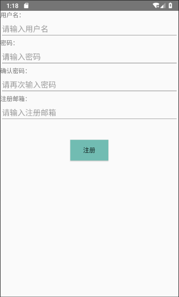
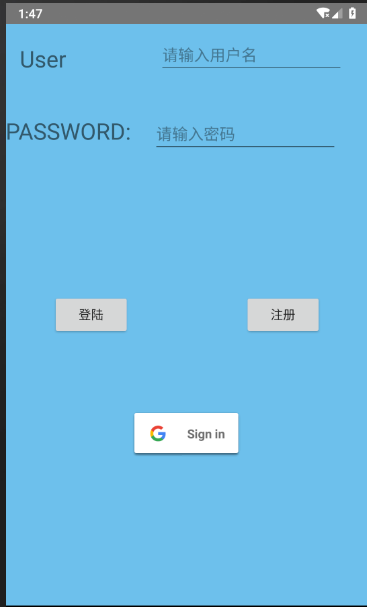
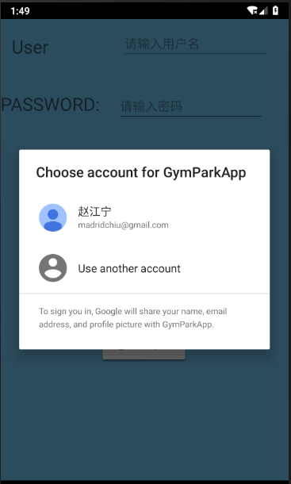
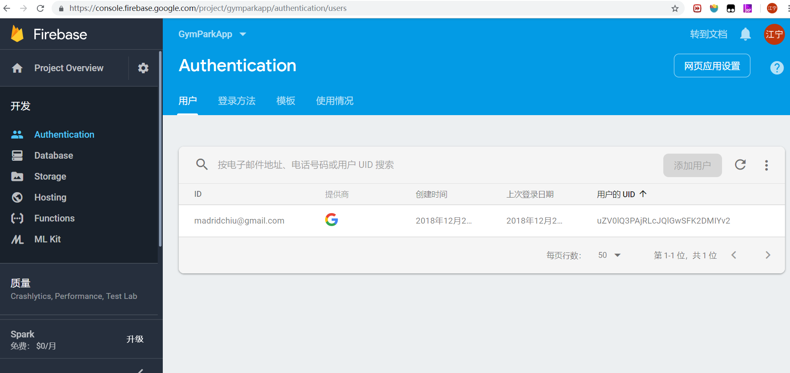

移动应用开发2018
===============
### 组员：赵江宁(16301056) 陈建秋(16301060) 张峰玮(16301067) 张袁峰(16301070)
#### 该部分组员:赵江宁,陈建秋
# 应用名称：GymParkApp
### Email: Madridchiu@gmail.com or 16301056@bjtu.edu.cn
## Assignment 1  
  
这是APP的UI Dashboard
这个主界面采用的是LinearLayout
一个组件分别为一个ImageView和三个Button
他们的Layout_weight都设置为1,所以比例都是一样大的   
  
这是APP的Navigation Bar
因为刚开始的时候我不了解NavigationBar,所以这是后面加的
问题就在于这个时候我已经把前面的主界面写好了,如果我想要把主界面加入NavigationBar的话有两个问题
第一个问题是我在主界面没有使用fragmentation,如果我点击navigation_bar中的选项的话切换的效果就很不好
第二个问题就是往写好activity加navigation_bar我想到的只有把activity嵌入一个新的drawer_layout,可那样未免有点麻烦
所以我干脆在专门写了一个测试navigation_bar的页面,虽然不实用,但是也算是一定程度上完成了任务吧
这个主要学习的是Android自己提供的Navigation Draw Activity,单击navigation bar中的sign out就可以登出账户,返回登录界面  

## Assignment 2
  

这是主程序的登录界面
关于终端服务器,我采用的是[Bmob后端云](bmob.cn)进行验证
关于Bmob使用过程中记得是碰到了一个异常,去StackOverflow查看一些答案后发现要在manifest上一行android:usesCleartextTraffic="true"才能解决
Bmob的使用算是比较简单的,首先就是建立一个类继承BmobObject对应的是在Bmob中建好的数据库,然后就可以在Activity使用Bmob的查询插入等功能了
当用户登录时我们会把用户的用户名和密码发给Bmob,让Bmob从数据库中找有没有这个用户,有则重新登录,没有则提示用户名或者密码错误
一开始我在谷歌上看到的也是普通的PHP+mysql来解决的,但是我自己对PHP一无所知,经过尝试后发现确实太耗时了,所以还是采用了使用后端云的方案  
  

这是注册的表格界面
我们会对用户输入的用户名是否为空,Email格式是否正确,两次输入的密码是否相同进行检查
验证邮箱格式的代码如下:
```Java
private boolean isValidEmail(CharSequence target) {
   return !TextUtils.isEmpty(target) && android.util.Patterns.EMAIL_ADDRESS.matcher(target).matches();
}
```
在确认用户输入的表格各项格式正确后,同样的,我们把数据发给Bmob,然后存进数据库.  
  
我们在这里使用了CardView Layout,忘记了使用RecyclerView不过我们在NewsDisplay中采用了RecyclerView
虽然有点诡异,求给分

## Assignment 3  
下面是视频播放列表和视频实际播放:  

  
  
对于视频播放功能,VideoView好像支持RTSP流的播放,不支持普通我们平时看到的http,这就很懵逼了
谷歌后发现的RTSP流结果只有youtube的,没有关于优酷之类的,脑壳痛
然后我发现虎扑上一些视频是可以用VideoView播放的,然后我很开心的就用虎扑的视频链接来播放视频了
代码如下:  
```java
public class DumbbellVideo extends AppCompatActivity {
    VideoView videoView;
    String url;

    @Override
    protected void onCreate(Bundle savedInstanceState) {
        super.onCreate(savedInstanceState);
        setContentView(R.layout.activity_dumbbell_video);
        url=getString(R.string.dumbbells);
        Uri uri=Uri.parse(url);
        videoView=findViewById(R.id.dumbbell_video);
        MediaController mc=new MediaController(this);
        mc.setAnchorView(videoView);
        videoView.setMediaController(mc);
        videoView.setVideoURI(uri);
        videoView.start();
    }
}
```
说起来也是好笑,我竟然用了不同的Activity来展示不同的视频,其实只要在点击不同视频图片时更改VideoView中链接就行了
算了,好歹也叫实现了

关于给Trainer打电话,当然要先往Manifest上加call_phone允许
说起permission的话一开始我以为只要往Manifest上加请求就会有或者是会自动申请请求
结果是对于一些比较重要的permission你还得自己却确认权限并申请
[安卓关于permission的overview](https://developer.android.com/guide/topics/permissions/overview)  
该APP用到的一些权限申请的代码如下:  
```java
        if(ContextCompat.checkSelfPermission(MainActivity.this,Manifest.permission.WRITE_EXTERNAL_STORAGE)!=
                PackageManager.PERMISSION_GRANTED){
            ActivityCompat.requestPermissions(MainActivity.this,new String[]{Manifest.permission.WRITE_EXTERNAL_STORAGE},1);
        }
        if(ContextCompat.checkSelfPermission(MainActivity.this,Manifest.permission.READ_PHONE_STATE)!=
                PackageManager.PERMISSION_GRANTED)
            ActivityCompat.requestPermissions(
                    MainActivity.this,new String[]{Manifest.permission.READ_PHONE_STATE},2);
        if(ContextCompat.checkSelfPermission(MainActivity.this,Manifest.permission.ACCESS_NETWORK_STATE)!=
                PackageManager.PERMISSION_GRANTED)
            ActivityCompat.requestPermissions(MainActivity.this,new String[]
                    {Manifest.permission.ACCESS_NETWORK_STATE},3);
```
下面是CALL PHONE界面:  
  
  
## Assignment 4
把trainer information以及articles离线储存使用的是SQLite数据库
代码过程参考的也是安卓官方给的教程
创建entry(不知道怎么表达,大概就是一个类用于存储表的各项数据,类似于metadata之类的),创建DBHelper,然后实际在Activity调用
下面是初始化以及插入的一些代码:  
```java
//        initNews();
        SQLiteDatabase db;
        DbHelper dbHelper=new DbHelper(this);
//        db=dbHelper.getWritableDatabase();
//        dbHelper.onUpgrade(db,1,1);
//        for(News news:mList)
//          dbHelper.insertItem(db,news.title,news.imageID);
        
        db=dbHelper.getReadableDatabase();
        Cursor cursor=db.query(NewsTable.NewsEntry.TABLE_NAME,projection,null,null,null,null,null);
        while(cursor.moveToNext()){
            News news;
            String title=cursor.getString(cursor.getColumnIndex(NewsTable.NewsEntry.COLUMN_NAME_TITLE));
            int imageID=cursor.getInt(cursor.getColumnIndex(NewsTable.NewsEntry.COLUMN_NAME_IMAGE));
            news=new News(title,imageID);
            mList.add(news);
        }
```
下面是文章展示,采用的是recyclerview+cardview  

  

## Assignment 5
终于也来到了最后一个Assignment,这次的Assignment难度也不大,就是有些麻烦.  
刚开始也是打算向微信那边申请的,但是申请等了三天一点回复也没有,想想也不能坐以待毙,决定找别的途径.
谷歌了一下,发现一个叫做firebase的东西意外的好用,只需要申请应用关联,然后就可以轻松的应用模板来完成一系列的操作了,
甚至连gradle都可以不用自己去配置,只需要打开android studio自带的firebase然后进去让它自己配置就好了.  
下面是一些完成后的图片:  
  

  

  

<font color=red>菜鸡写代码不容易,求老师多给点分吧,嘤嘤嘤😭😭😭</font>
<font color=red>菜鸡写代码不容易,求老师多给点分吧,嘤嘤嘤😭😭😭</font>


